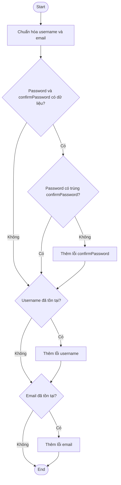
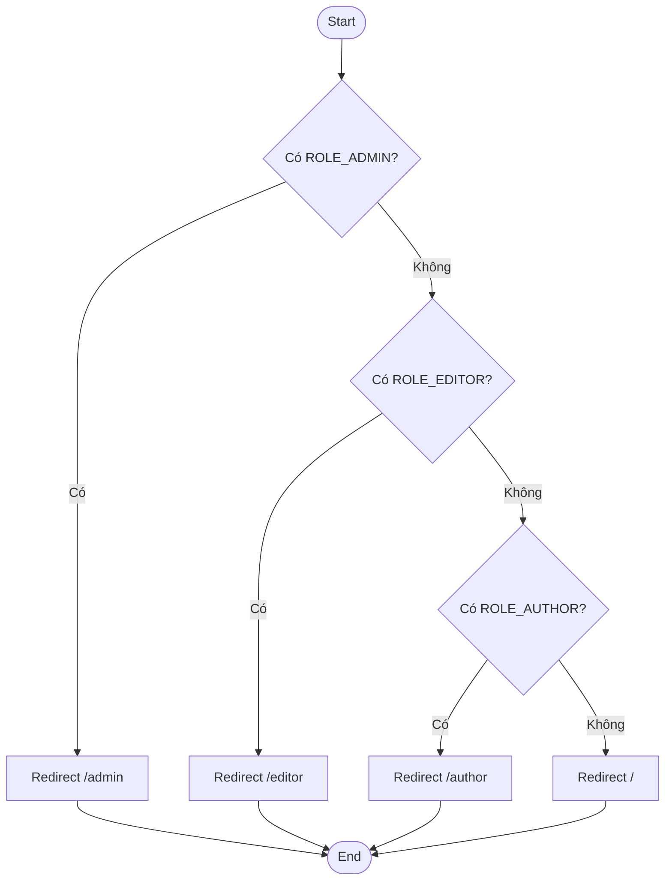
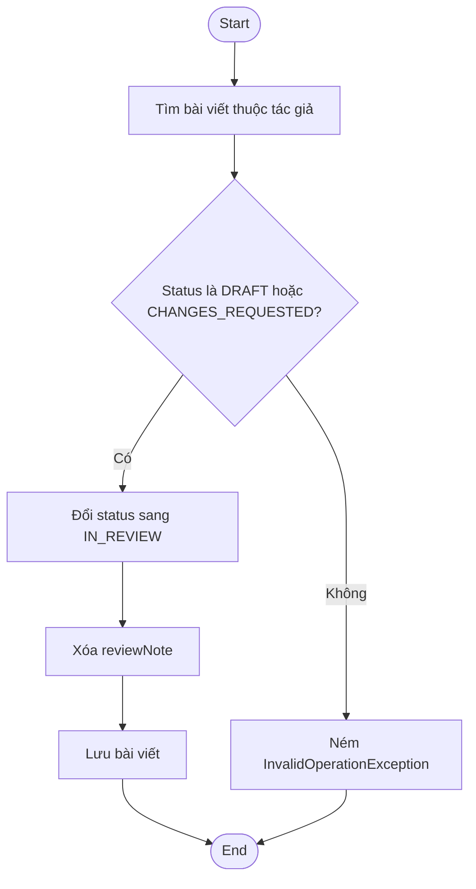
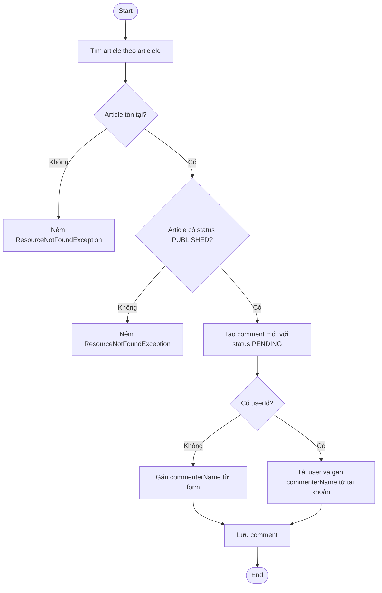

# Phụ lục - Control Flow Graph và Coverage

Các CFG dưới đây được dùng cho phần White-box testing trong báo cáo. Mỗi CFG tương ứng với một đoạn chương trình đại diện cho một chức năng được chọn để kiểm thử chuyên sâu.

## 1. `AuthService.validateRegistrationForm`

## 2. `SecurityConfig.handleSuccessRedirect`

## 3. `ArticleWorkflowService.submitForReview`

## 4. `CommentService.createComment`

## 5. Coverage áp dụng

| Đoạn chương trình | Test case White-box | Mức bao phủ mục tiêu |
| --- | --- | --- |
| `AuthService.validateRegistrationForm` | `WB-TC01`, `WB-TC02` | Phủ lệnh, phủ nhánh, phủ điều kiện |
| `SecurityConfig.handleSuccessRedirect` | `WB-TC03`, `WB-TC04`, `WB-TC05`, `WB-TC06` | Phủ lệnh, phủ nhánh, phủ đường đi chính |
| `ArticleWorkflowService.submitForReview` | `WB-TC07`, `WB-TC08`, `WB-TC09` | Phủ lệnh, phủ nhánh, phủ đường đi |
| `CommentService.createComment` | `WB-TC10`, `WB-TC11`, `WB-TC12` | Phủ lệnh, phủ nhánh, phủ đường đi chính |
